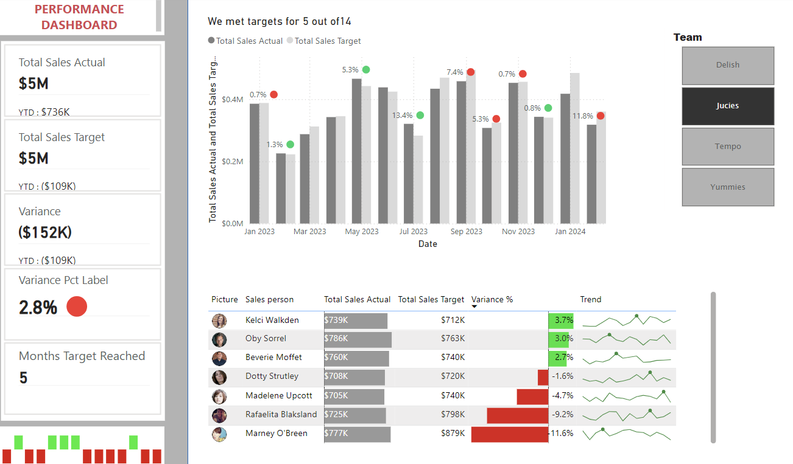

# Power BI Finance KPI Dashboard

## 📊 Overview
This project is a **Power BI Dashboard** designed to visualize financial KPIs. It transforms raw business data into actionable insights using a streamlined 4-step process.

---

## 🖼️ Dashboard Preview
Below is a preview of the **Finance KPI Dashboard**:

## ✨ Features
- **Sales Overview**: Analyze revenue, profits, and growth trends.  
- **Top KPIs**: Includes key metrics like YTD values and profit margins.  
- **Interactive Visuals**: Dynamic charts, slicers, and smart narratives for intuitive exploration.  
- **Advanced Insights**: Leverage advanced DAX functions and custom visualizations.  

---

## 🔧 Key Steps
1. **Data Preparation**: Use **Power Query** for connecting and transforming raw data.  
2. **Data Modeling**: Establish relationships between multiple fact tables for a robust model.  
3. **Calculations**: Perform advanced calculations using **DAX** (e.g., YTD values, FILTER functions).  
4. **Dashboard Design**: Create visually appealing and interactive KPI dashboards.

---

## 🎓 Key Topics Covered
- **Power Query**: Unpivot and transform data.  
- **Data Modeling**: Work with multiple fact tables.  
- **DAX Calculations**: YTD values, custom labels, emojis in visuals.  
- **New Features**: Card visual, sparklines, smart narratives.  
- **Formatting**: Executive-level table and report themes.  

---

## 🗂️ Files Included
- **FinanceDashboard.pbix**: Power BI file with the completed dashboard.  
- **SampleData.xlsx**: Raw data used for analysis.  
- **README.md**: Documentation for the project.

---

## 🚀 How to Use
1. Open the **FinanceDashboard.pbix** file in Power BI Desktop.  
2. Load the provided data or connect your own source data.  
3. Explore and customize the dashboard to suit your needs.  

---

## 📈 Insights Provided
- Track financial KPIs like revenue, profit, and YTD growth.  
- Identify trends and actionable insights using visuals and narratives.  
- Analyze key drivers of business performance.  

---

## 🛠️ Tools Used
- **Power BI Desktop**: For data modeling, calculations, and dashboard creation.  
- **Power Query**: For data cleaning and preparation.  
- **DAX**: For advanced calculations and metrics.

---

## 🤝 Contributing
Contributions are welcome! Submit a pull request or raise an issue for suggestions and improvements.
